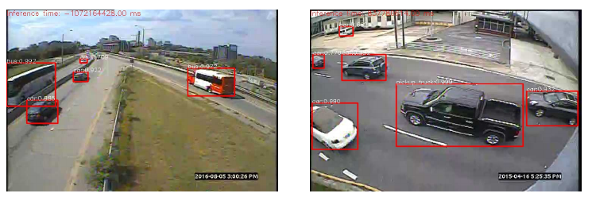

<link rel="stylesheet" type="text/css" media="all" href="styles/styles.css" />
<link rel="stylesheet" href="https://cdn.rawgit.com/konpa/devicon/master/devicon.min.css">

# Matthew's Academic Projects Portfolio
<h2>Table of Contents</h2>
<ul>
  <li><a href="#description"> General Description</a></li>
  <li><a href="#comp-767-reinforcement-learning">COMP-767 Reinforcement Learning:</a></li>
  <ul>
    <li><a href="#comp-767-reinforcement-learning-a">Assignments</a></li>
    <li><a href="#comp-767-reinforcement-learning-p">Final Project: State and Policy Representation Transfer in Reinforcement Learning</a></li>
  </ul>
  <li><a href="#comp424-artificial-intelligence">COMP 424 - Artificial Intelligence</a></li>
  <li><a href="ecse-415-computer-vision-a">ECSE-415 Computer Vision:</a></li>
  <ul>
    <li><a href="ecse-415-computer-vision-a">Assignments</a></li>
    <li><a href="ecse-415-computer-vision-p">Final Project: Vehicle Classification and Localization</a></li>
  </ul>
  <li><a href="#ecse-489-telecommunications-lab">ECSE-489 Telecommunications Lab DNS Client</a>
</ul>

<h2 id="description">General Description</h2>

In this repository, you'll find the various programming projects and assignmentes I have worked on
while at __McGill__ as either a Computer Engineering undergraduate or a Computer
Science graduate student.

I've included this `README` to list out all the programming projects I've
aggregated in this repository, and give a small summary for each one.
Each project has its own `README` that contains more details for either
installing, running or just clarifying more about the project.

__Note:__ `COMP` and `ECSE` are course code prefixes. `COMP` courses are offered by the School of Computer Science whereas `ECSE` courses are offered by the Faculty of Electrical, Computer and Software Engineering. Also this is a work in progress, existing or new work is added periodically to this list.

<h2 id="comp-767-reinforcement-learning">COMP-767 Reinforcement Learning</h2>
<h3 id="comp-767-reinforcement-learning-p" style="display: inline;"><a href="https://github.com/mattesko/Transfer-Deep-Reinforcement-Learning">Final Project</a></h3>
<!--   -->

<h2 id="ecse-489-telecommunications-lab" style="display: inline;"><a href="https://github.com/mattesko/DnsClient">ECSE-489 Telecommunications Lab DnsClient</a></h2> 
<!--   -->

This was a team project for a telecommunications and networking laboratory course. 
My teammate and I implemented a command line Domain Name Service (DNS) client in Java.
The client supports A, MX and NS query types. 

Project installation and source code is available [here](https://github.com/mattesko/DnsClient).

<h2 id="ecse-415-computer-vision">ECSE-415 Computer Vision</h2>

<h3 id="ecse-415-computer-vision-a" style="display: inline;"><a href="https://github.com/mattesko/ECSE415-Assignments" >Assignments</a></h3> 
<!--  -->

<!-- ## [ECSE-415 Computer Vision](https://github.com/mattesko/ECSE415-Assignments) ![icon][python-icon] -->
I used Python 3.7 and OpenCV to accomplish computer vision tasks involving: 
- [Face detection and recognition](https://github.com/mattesko/ECSE415-Assignments/blob/master/Assignment_4/face_detection.ipynb) using Eigenfaces (Principal Component Analysis), K-Nearest-Neighbor classifiers, and the Viola-Jones face detection algorithm;
- [Implementing the unsupervised learning algorithms KMeans Clustering and Expectation-Maximization from scratch for scene segmentation](https://github.com/mattesko/ECSE415-Assignments/blob/master/Assignment_3/Kmeans_EM.ipynb);
- [Depth map estimation](https://github.com/mattesko/ECSE415-Assignments/blob/master/Assignment_3/Depth_Estimation.ipynb) within the context of stereo vision (multiple viewpoints for the an object);
- [Epipolar line estimation](https://github.com/mattesko/ECSE415-Assignments/blob/master/Assignment_3/Epipolar_Geometry.ipynb) within the context of stereo vision;
- [Image stitching](https://github.com/mattesko/ECSE415-Assignments/blob/master/Assignment_2/stitching.ipynb) using SURF feature detection, RANSAC feature matching, homography estimation, and pyramid image blurring;
- [Vehicle logo image classification](https://github.com/mattesko/ECSE415-Assignments/blob/master/Assignment_2/classification.ipynb) using HoG features and K-Nearest-Neighbors;
- [Edge detection using Laplace of Gaussians](https://github.com/mattesko/ECSE415-Assignments/blob/master/Assignment_1/LoG_edge.ipynb) and [Sobel filters](https://github.com/mattesko/ECSE415-Assignments/blob/master/Assignment_1/sobel_edge.ipynb), [denoising](https://github.com/mattesko/ECSE415-Assignments/blob/master/Assignment_1/denoising.ipynb), and [sharpness enhancing](https://github.com/mattesko/ECSE415-Assignments/blob/master/Assignment_1/sharpening.ipynb);

<h3 id="ecse-415-computer-vision-p" style="display: inline;"><a href="https://github.com/tristantoupin/ECSE415-FinalProject">Final Project: Vehicle Classification and Localization</a></h3> 
<!--  -->

This was a team project of 4 people to train different machine learning models for vehicle classification and detection. Our team used Python 3.7, OpenCV, Scikit-Learn, and Keras.
We used the [MIO-TCD vehicle dataset](http://tcd.miovision.com/). 
A [final report](https://github.com/tristantoupin/ECSE415-FinalProject/blob/master/docs/ECSE_415_Project_Report.pdf) accompanies the project.

I worked on developing a machine learning pipeline involving Histogram of Orientation feature extraction and SVM classifier training and evaluation which can be viewed [here](https://github.com/tristantoupin/ECSE415-FinalProject/blob/master/classification/SVM_classifier.ipynb).

My team also trained and evaluated the YOLOv3 model for vehicle [classification](https://github.com/tristantoupin/ECSE415-FinalProject/blob/master/classification/CNN.ipynb) and [bounding box localization](https://github.com/tristantoupin/ECSE415-FinalProject/tree/master/localization). Here's an example output from the localizer:

<!-- References to images -->
[java-icon]: icons/java-original.svg
[python-icon]: icons/python-original.svg
